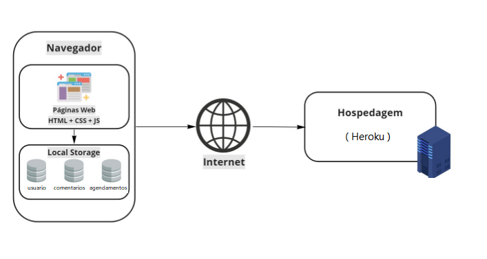

# Arquitetura da Solução

Pré-requisitos: <a href="3-Projeto de Interface.md"> Projeto de Interface</a>

Definição de como o software é estruturado em termos dos componentes que fazem parte da solução e do ambiente de hospedagem da aplicação.

## Diagrama de componentes

Exemplo: 

Os componentes que fazem parte da solução são apresentados na Figura XX.

Figura XX - Arquitetura da Solução

A solução implementada conta com os seguintes módulos:
- **Navegador** - Interface básica do sistema  
  - **Páginas Web** - Conjunto de arquivos HTML, CSS, JavaScript e imagens que implementam as funcionalidades do sistema.
   - **Local Storage** - armazenamento mantido no Navegador, onde são implementados bancos de dados baseados em JSON. São eles: 
     - **Úsuarios** - registro de informações (ID, nome, e-mail, senha, endereço, histórico de agendamentos, e informações adicionais) sobre os usuários cadastrados 
     - **Comentários** - registro de opiniões dos usuários sobre as notícias
     - **Preferidas** - lista de notícias mantidas para leitura e acesso posterior
 - **Hospedagem** - local na Internet onde as páginas são mantidas e acessadas pelo navegador. 
  - **Tecnologias Utilizadas** - Serão utilizadas na aplicação as seguintes tecnologias: JavaScript, HTML, CSS, Visual Studio Code. 

A imagem a seguir ilustra a o fluxo do usuário em nossa solução.
(img/diagrama_fluxo.JPG)

 A primeira tela do site é a tela inicial que contem notícias da área da saúde, opções de agendamento de consultas e exames, ver especialidades, sobre nós, contato e login no site.

fluxo do login

Login
Nesta tela o usuário deverá informar o usuário e a senha para efetuar o login e também permite recuperar a senha e o cadastro caso seja um novo usuário.

Cadastro

Na tela de cadastro, o usuário deve informar os dados para se cadastrar no sistema.

Recuperar senha

Nesta tela o usuário deverá informar seu e-mail para receber um e-mail permitindo a criação de uma nova senha.
Todas as especialidades e exames laboratoriais.

exibe em formato de lista todas as especialidades e exames que oferecemos atendimento.

Agendar consultas e exames.

O usuário sera direcionado para tela de agendamento onde tera que informar para quem sera o atendimento, se o agendamento sera feito pelo SUS, convenio ou particular, preenchendo todas as opções ele dará seguimento para a pagina de agendamento de exame ou consulta onde tera as opções de escolher as especialidades ou categoria de exame, logo ficara disponível as opções de data, período, corpo clinico e local.

Após selecionar e dar seguimento ficara disponível o resumo do agendamento onde tera todas as informações do mesmo e dando as acoes de confirmar ou cancelar.

Apos a confirmação do agendamento o usuário sera direcionado para a tela                                                                                                                          de agendamento finalização onde informara que o agendamento foi realizado com sucesso e que o usuário recebera um e-mail e confirmação, logo em seguida tera a opção de  participar da pesquisa de satisfa  onde ele poderá deixar seu relato ou a opção de voltar a tela inicial.

sobre nos

tera as informações sobre a empresa e os serviços que ela presta.

Contato

essa tela conta os meios para contato e-mail e telefone.

 noticias
 
um link externo com informações ou pesquisas sobre a área da saúde.

## Tecnologias Utilizadas

Serão utilizadas na aplicação as seguintes tecnologias: JavaScript, HTML, CSS, Visual Studio Code. 

## Hospedagem

Explique como a hospedagem e o lançamento da plataforma foi feita.

> **Links Úteis**:
>
> - [Website com GitHub Pages](https://pages.github.com/)
> - [Programação colaborativa com Repl.it](https://repl.it/)
> - [Getting Started with Heroku](https://devcenter.heroku.com/start)
> - [Publicando Seu Site No Heroku](http://pythonclub.com.br/publicando-seu-hello-world-no-heroku.html)
